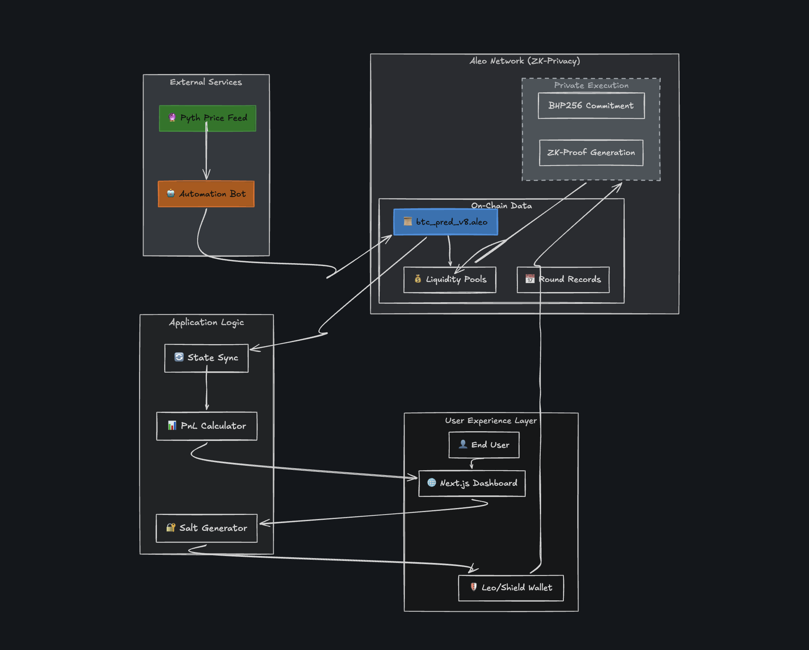

# DART Protocol

<p align="center">
  
  
  
  
</p>

**The problem is not privacy by itself. The problem is that fast markets break without it.**

Every prediction market today has the same flaw: the moment you place a bet, everyone sees it. On a slow market, that is survivable. On a fast market, it is fatal. A whale enters, the pool shifts, traders copy, bots front-run, and the market starts reacting to visible order flow instead of the event itself.

**DART fixes this by making order flow invisible.** Your bet side is a private input to an Aleo circuit, the contract stores a commitment hash instead of your direction, and only the combined pool total updates while betting is active. After the round settles, the per-side breakdown is revealed, but by then there is nothing left to game.

DART is built around one thesis:

**5-minute markets only become usable when trader intent stays private.**

Built for the **Aleo x AKINDO buildathon**.

---

## DART vs. Public Markets

```text
On Polymarket:                          On DART:
─────────────────────────────           ─────────────────────────────
Alice bets YES, $10                     Alice calls bet()
Pool: YES $8,420 / NO $6,310           Pool total: $14,740
Odds shift to 57/43                     Pool total: $14,750
Everyone adjusts their bets             Nobody knows anything changed
Bob front-runs with $500 on YES         Bob sees nothing to front-run
```

Three things happen simultaneously when Alice bets:

1. **Her bet side is a private input** and never appears on-chain.
2. **The contract stores `hash(side, amount, salt)`** instead of the side itself.
3. **Only the combined pool total updates** while the YES and NO split stays hidden.

After the round ends, Alice reveals her commitment to claim. At that point the market is already settled, so there is nothing left to front-run.

---

## Why 5-Minute Markets

Most prediction products optimize for long-duration markets.

DART is optimized for **live reaction windows**:
- a CPI print
- an FOMC decision
- a key BTC breakout level
- a liquidation cascade
- a short community sentiment window

The 5-minute round is not a gimmick. It is the product. It captures immediate conviction while privacy prevents copy-trading from overwhelming the market.

---

## Why This Requires Aleo

This is not a frontend privacy wrapper on top of a transparent chain.

On transparent chains:
- `bet(side, amount)` exposes the side in calldata
- pool updates reveal where money went
- commit-reveal still leaks too much in fast markets
- pending intent is visible before confirmation

On Aleo:
- `side` and `salt` are private inputs
- the circuit proves the bet is valid without revealing it
- the contract updates only the total pool during betting
- the bettor can reveal the preimage later to claim

The privacy primitive is native to Aleo's execution model. It is not bolted on after the fact.

---

## Architecture

<p align="center">
  
</p>

The system has four main layers:
- external services for price input and automation
- Aleo private execution for commitments and proof generation
- on-chain market state for rounds, pools, and claims
- frontend application logic for sync, wallet flow, and UX

### Frontend

Next.js 16, TypeScript, Tailwind CSS 4, Framer Motion, Shield Wallet integration, live BTC charting, and a Gemini-powered voice assistant.

| Page | Purpose |
|---|---|
| `/markets` | Active round, betting panel, live chart |
| `/portfolio` | Positions, PnL, claim flow |
| `/how-it-works` | Privacy architecture walkthrough |
| `/leaderboard` | Predictor ranking UI |
| `/test-wallet` | Wallet capability testing |

### Contract

`btc_pred_v8.aleo` is the market contract. It stores commitments, pool state, outcomes, and claim status.

| Function | Who | What |
|---|---|---|
| `bet(rid, amt, side, salt)` | Anyone | Place bet, store commitment, get receipt |
| `claim(rid, side, amt, salt, payout)` | Anyone | Reveal preimage and receive winnings |
| `forfeit(rid, side, amt, salt)` | Anyone | Reveal preimage and release losing bet |
| `create_round(rid, target, deadline, seed)` | Admin | Start a new round |
| `resolve(rid, price, yes, no)` | Admin | End round and reveal pools |
| `init_admin()` | Once | Set admin address |
| `withdraw_fees(amt)` | Admin | Withdraw platform fees |

### Auto-Resolver

The resolver service fetches BTC/USD from Pyth, creates rounds, monitors deadlines, resolves outcomes, and tracks per-side totals for dark-pool reveal.

---

## How It Works

### 1. Bet

```text
bet(round_id, amount, side, salt)
```

Inside the circuit:

```text
commit = hash(side, amount, salt)
```

On-chain, the protocol stores:
- the commitment
- the amount
- the combined round pool

What it does **not** reveal during betting:
- bet side
- side-specific pool composition
- salt

### 2. Resolve

When the round ends, the resolver submits:
- final BTC price
- YES total
- NO total

The contract verifies:

```text
yes_total + no_total == total_pool
```

Then the outcome is finalized and the hidden YES/NO split becomes visible.

### 3. Claim

Winners reveal:
- round id
- side
- amount
- salt
- payout

The contract verifies the preimage matches the stored commitment, then transfers winnings.

---

## Design Decisions

DART went through 8 contract versions. Each one exposed a real failure mode.

### Why not records for claims? (v7 -> v8)

Earlier versions used a record-based claim model inspired by slot-based designs. In theory it was elegant. In practice, it depended on the wallet reliably finding and returning records at claim time.

That proved brittle.

v8 eliminates record inputs entirely. Claims use scalar values:

```text
(roundId, side, amount, salt, payout)
```

The wallet only needs `executeTransaction`, which made the claim path far more reliable.

### Why random salt?

Deterministic salt based on public values is insecure because every input except `side` is visible. Since `side` is binary, an attacker can brute-force both possibilities and compare hashes.

Random salt stored client-side is the simplest design that preserves hiding.

### Why parimutuel, not AMM?

Prediction markets have binary outcomes. AMM curves create artificial slippage that does not reflect actual event probability. Parimutuel pooling is simpler and better aligned with binary settlement.

---

## Evolution

| Version | What Broke -> What We Built |
|---|---|
| v1-v2 | First working prediction market on Aleo |
| v3 | Bets were public -> private BetReceipt records + reputation |
| v4 | Custom token friction -> native Aleo credits |
| v5 | Credits too volatile -> USDCx stablecoin |
| v6 | Record-based claims were complex -> mapping-based claims |
| v7 | Pool composition leaked sentiment -> dark pool + private bet sides |
| **v8** | **Wallet could not reliably pass records -> commitment scheme with all-scalar claims** |

This architecture was not planned up front. It evolved by removing failure points discovered during testing.

---

## What v8 Solved

| Problem in v7 | How v8 Fixed It |
|---|---|
| Claims required record inputs and wallet retrieval was unreliable | Commitment scheme with all-scalar claims |
| Users could get stuck if records were not available | No records needed for claim |
| Slot model limited flexibility | Bets can be placed without slot-style claim blocking |
| Pool composition leaked sentiment | Dark-pool total stays public while side split stays hidden |

---

## Deployment

| Component | Location | Details |
|---|---|---|
| Contract | Aleo Testnet | `btc_pred_v8.aleo` |
| Frontend | Vercel | Frontend dashboard and markets UI |
| Resolver | Railway | Pyth-driven round manager |
| Token | Aleo Testnet | `test_usdcx_stablecoin.aleo` (USDCx) |

Program address:

```text
aleo1v5wrxmqe2urj30wqxyhnfymghw03kcdgu2pdcv7hhlw3z2vcs5rqwl2f7e
```

Before final judging, add:
- short demo video
- example bet transaction
- example claim transaction

Live frontend:

```text
https://cyberquill.xyz/
```

Vercel deployment:

```text
https://frontend-liln55rdu-afeezs-projects-2285b811.vercel.app/
```

---

## Running Locally

```bash
git clone https://github.com/shaibuafeez/dart.git
cd dart

# Frontend
npm install
npm run dev

# Contract
cd btc_pred_v8
leo build

# Backend
cd ../backend
npm install
npm run build
npm start
```

Testing flow:
- install Shield Wallet
- bridge USDCx
- connect on the Markets page
- place a bet
- wait for resolution
- claim from Portfolio

---

## Current Limitations

- **Local salt storage**: clearing browser storage breaks claim recovery for that browser.
- **Resolver trust**: round resolution still depends on an external resolver service.
- **Off-chain side tallying**: side-specific totals are tracked off-chain until reveal.
- **Admin controls**: round management is not yet decentralized.
- **Oracle trust**: resolution still depends on trusted price input from the resolver path.

---

## Links

| | |
|---|---|
| **GitHub** | [github.com/shaibuafeez/dart](https://github.com/shaibuafeez/dart) |
| **Live App** | [cyberquill.xyz](https://cyberquill.xyz/) |
| **Vercel Deployment** | [frontend-liln55rdu-afeezs-projects-2285b811.vercel.app](https://frontend-liln55rdu-afeezs-projects-2285b811.vercel.app/) |
| **USDCx Bridge** | [usdcx.aleo.dev](https://usdcx.aleo.dev/) |
| **Shield Wallet** | [shieldwallet.xyz](https://www.shieldwallet.xyz/) |
| **Aleo Explorer** | [testnet.explorer.provable.com](https://testnet.explorer.provable.com) |

---

## Closing

DART is an experiment in a market design that only makes sense with private execution:
- fast rounds
- hidden conviction
- no visible order flow
- auditable settlement

That is the core idea behind DART:

**a prediction market where the market cannot watch you think.**
