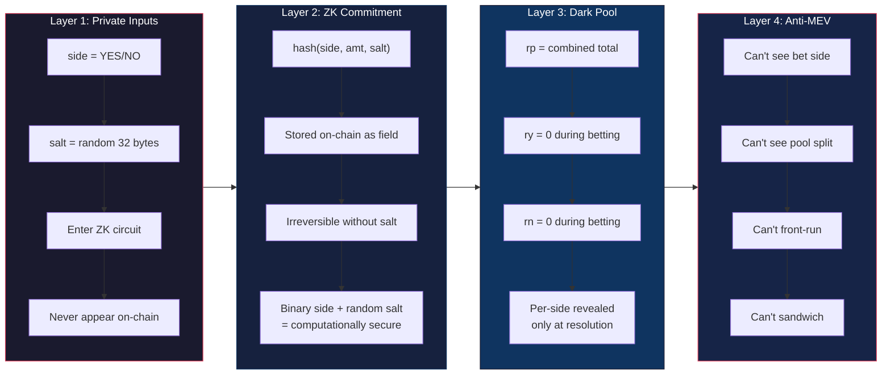
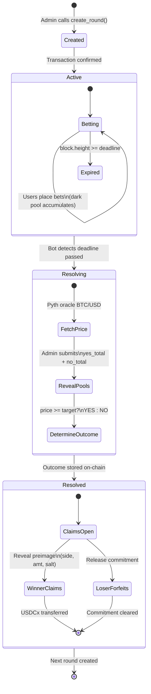
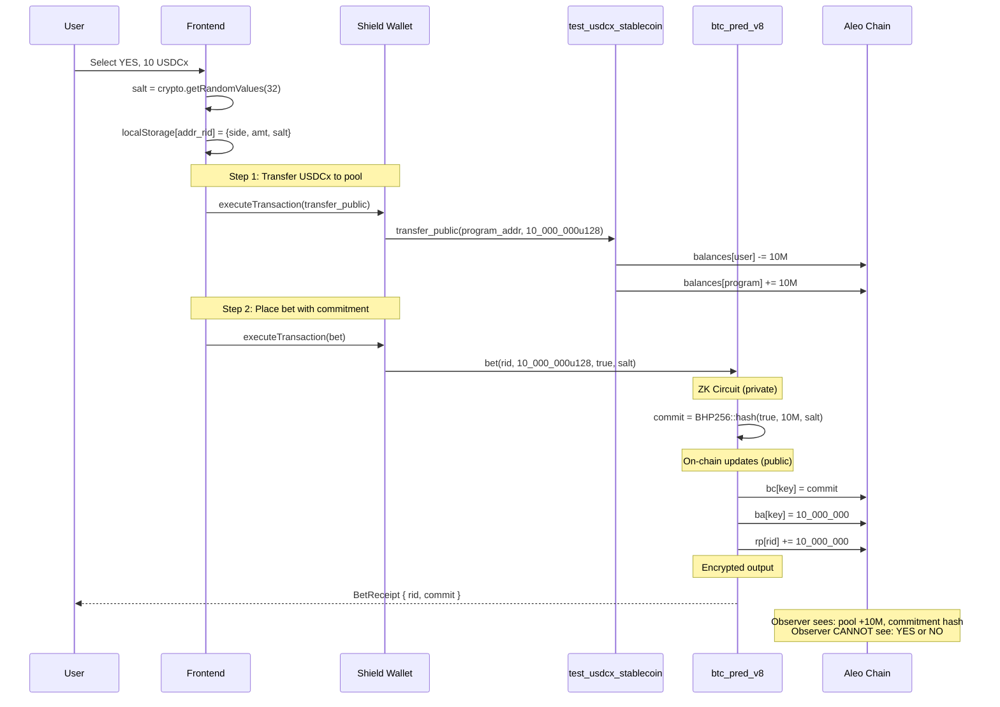
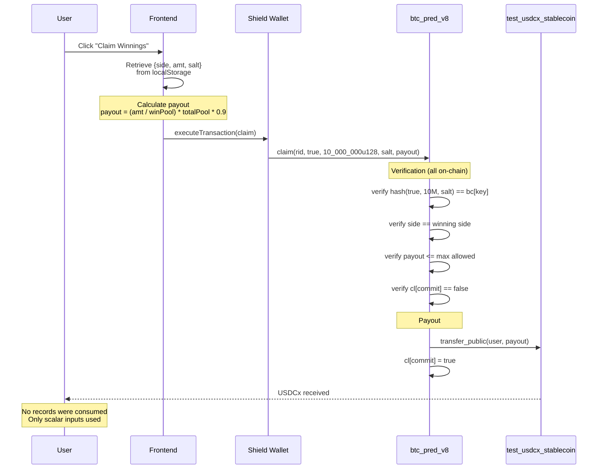
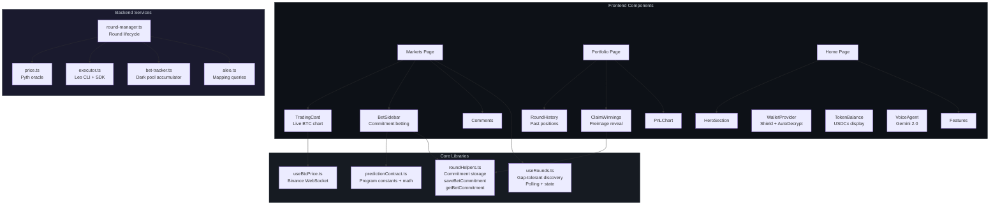

# DART Protocol Architecture

## Full System Flow

```mermaid
flowchart TB
    subgraph User["User (Bettor)"]
        A[Connect Shield Wallet]
        B[Choose YES or NO]
        C[Enter Amount]
        D[View BetReceipt]
        E[Wait for Resolution]
        F{Won or Lost?}
        G[Claim Winnings]
        H[Forfeit Position]
    end

    subgraph Frontend["Frontend — Next.js 16"]
        FE1[Markets Page<br/>Live BTC Chart + Countdown]
        FE2[Generate Random Salt<br/>crypto.getRandomValues]
        FE3[Save Salt to localStorage<br/>key: address_roundId]
        FE4[Portfolio Page<br/>Positions + P&L]
        FE5[Retrieve Salt from localStorage]
    end

    subgraph Wallet["Shield Wallet"]
        W1[Sign USDCx Transfer]
        W2[Sign bet Transaction]
        W3[Sign claim Transaction]
        W4[Sign forfeit Transaction]
    end

    subgraph Blockchain["Aleo Testnet"]
        subgraph USDCx["test_usdcx_stablecoin.aleo"]
            U1[transfer_public<br/>user → program address]
            U2[transfer_public<br/>program → winner]
        end

        subgraph Contract["btc_pred_v8.aleo"]
            subgraph ZK["ZK Circuit — Private"]
                ZK1[Receive side + salt<br/>as private inputs]
                ZK2[Compute commit =<br/>BHP256::hash side amt salt]
            end

            subgraph Public["On-Chain Mappings — Public"]
                M1["bc[key] = commit hash"]
                M2["ba[key] = bet amount"]
                M3["rp[rid] += amount<br/>(dark pool total)"]
                M4["ry[rid] = 0 (hidden)<br/>rn[rid] = 0 (hidden)"]
                M5["ro[rid] = outcome<br/>ry[rid] = yes_total<br/>rn[rid] = no_total"]
                M6["cl[commit] = true"]
            end

            subgraph Output["Encrypted Output"]
                R1["BetReceipt {<br/>  owner, rid, commit<br/>}<br/>Only bettor can decrypt"]
            end

            BET["bet(rid, amt, side, salt)"]
            CLAIM["claim(rid, side, amt, salt, payout)"]
            FORFEIT["forfeit(rid, side, amt, salt)"]
            RESOLVE["resolve(rid, price, yes, no)"]
            CREATE["create_round(rid, target, deadline, seed)"]
        end
    end

    subgraph Bot["Auto-Resolver — Railway"]
        BOT1[Fetch BTC/USD from Pyth]
        BOT2[Monitor block height]
        BOT3[Track per-side bets<br/>off-chain accumulator]
        BOT4{Deadline passed?}
        BOT5[Submit resolve with<br/>price + pool split]
        BOT6[Create next round]
    end

    %% Betting Flow
    A --> FE1
    B --> FE2
    FE2 --> FE3
    C --> W1
    W1 --> U1
    U1 --> W2
    W2 --> BET
    BET --> ZK1
    ZK1 --> ZK2
    ZK2 --> M1
    BET --> M2
    BET --> M3
    BET --> R1
    R1 --> D

    %% Resolution Flow
    BOT1 --> BOT2
    BOT2 --> BOT4
    BOT4 -->|Yes| BOT5
    BOT5 --> RESOLVE
    RESOLVE --> M5
    BOT4 -->|No| BOT2
    RESOLVE --> BOT6
    BOT6 --> CREATE

    %% Claim Flow
    E --> F
    F -->|Won| FE4
    FE4 --> FE5
    FE5 --> W3
    W3 --> CLAIM
    CLAIM --> M6
    CLAIM --> U2
    U2 --> G

    F -->|Lost| FE4
    FE5 --> W4
    W4 --> FORFEIT
    FORFEIT --> H

    %% Styling
    classDef private fill:#1a1a2e,stroke:#e94560,color:#fff
    classDef public fill:#0f3460,stroke:#16213e,color:#fff
    classDef user fill:#162447,stroke:#e94560,color:#fff
    classDef wallet fill:#1b1b2f,stroke:#1f4068,color:#fff

    class ZK1,ZK2,R1 private
    class M1,M2,M3,M4,M5,M6 public
```

## Privacy Layers

```mermaid
flowchart LR
    subgraph Layer1["Layer 1: Private Inputs"]
        direction TB
        L1A[side = YES/NO] --> L1B[salt = random 32 bytes]
        L1B --> L1C[Enter ZK circuit]
        L1C --> L1D[Never appear on-chain]
    end

    subgraph Layer2["Layer 2: ZK Commitment"]
        direction TB
        L2A["hash(side, amt, salt)"] --> L2B[Stored on-chain as field]
        L2B --> L2C[Irreversible without salt]
        L2C --> L2D[Binary side + random salt<br/>= computationally secure]
    end

    subgraph Layer3["Layer 3: Dark Pool"]
        direction TB
        L3A[rp = combined total] --> L3B[ry = 0 during betting]
        L3B --> L3C[rn = 0 during betting]
        L3C --> L3D[Per-side revealed<br/>only at resolution]
    end

    subgraph Layer4["Layer 4: Anti-MEV"]
        direction TB
        L4A[Can't see bet side] --> L4B[Can't see pool split]
        L4B --> L4C[Can't front-run]
        L4C --> L4D[Can't sandwich]
    end

    Layer1 --> Layer2 --> Layer3 --> Layer4

    style Layer1 fill:#1a1a2e,stroke:#e94560,color:#fff
    style Layer2 fill:#16213e,stroke:#0f3460,color:#fff
    style Layer3 fill:#0f3460,stroke:#1a1a2e,color:#fff
    style Layer4 fill:#162447,stroke:#e94560,color:#fff
```

## Round Lifecycle

```mermaid
stateDiagram-v2
    [*] --> Created: Admin calls create_round()

    Created --> Active: Transaction confirmed
    state Active {
        [*] --> Betting
        Betting --> Betting: Users place bets\n(dark pool accumulates)
        Betting --> Expired: block.height >= deadline
    }

    Active --> Resolving: Bot detects deadline passed

    state Resolving {
        [*] --> FetchPrice: Pyth oracle BTC/USD
        FetchPrice --> RevealPools: Admin submits\nyes_total + no_total
        RevealPools --> DetermineOutcome: price >= target?\nYES : NO
    }

    Resolving --> Resolved: Outcome stored on-chain

    state Resolved {
        [*] --> ClaimsOpen
        ClaimsOpen --> WinnerClaims: Reveal preimage\n(side, amt, salt)
        ClaimsOpen --> LoserForfeits: Release commitment
        WinnerClaims --> [*]: USDCx transferred
        LoserForfeits --> [*]: Commitment cleared
    }

    Resolved --> [*]: Next round created
```

## Bet Transaction Detail

```mermaid
sequenceDiagram
    participant User
    participant Frontend
    participant Shield as Shield Wallet
    participant USDCx as test_usdcx_stablecoin
    participant DART as btc_pred_v8
    participant Chain as Aleo Chain

    User->>Frontend: Select YES, 10 USDCx
    Frontend->>Frontend: salt = crypto.getRandomValues(32)
    Frontend->>Frontend: localStorage[addr_rid] = {side, amt, salt}

    Note over Frontend,Shield: Step 1: Transfer USDCx to pool
    Frontend->>Shield: executeTransaction(transfer_public)
    Shield->>USDCx: transfer_public(program_addr, 10_000_000u128)
    USDCx->>Chain: balances[user] -= 10M
    USDCx->>Chain: balances[program] += 10M

    Note over Frontend,Shield: Step 2: Place bet with commitment
    Frontend->>Shield: executeTransaction(bet)
    Shield->>DART: bet(rid, 10_000_000u128, true, salt)

    Note over DART: ZK Circuit (private)
    DART->>DART: commit = BHP256::hash(true, 10M, salt)

    Note over DART: On-chain updates (public)
    DART->>Chain: bc[key] = commit
    DART->>Chain: ba[key] = 10_000_000
    DART->>Chain: rp[rid] += 10_000_000

    Note over DART: Encrypted output
    DART-->>User: BetReceipt { rid, commit }

    Note over Chain: Observer sees: pool +10M, commitment hash<br/>Observer CANNOT see: YES or NO
```

## Claim Transaction Detail

```mermaid
sequenceDiagram
    participant User
    participant Frontend
    participant Shield as Shield Wallet
    participant DART as btc_pred_v8
    participant USDCx as test_usdcx_stablecoin

    User->>Frontend: Click "Claim Winnings"
    Frontend->>Frontend: Retrieve {side, amt, salt}<br/>from localStorage

    Note over Frontend: Calculate payout<br/>payout = (amt / winPool) * totalPool * 0.9

    Frontend->>Shield: executeTransaction(claim)
    Shield->>DART: claim(rid, true, 10_000_000u128, salt, payout)

    Note over DART: Verification (all on-chain)
    DART->>DART: verify hash(true, 10M, salt) == bc[key]
    DART->>DART: verify side == winning side
    DART->>DART: verify payout <= max allowed
    DART->>DART: verify cl[commit] == false

    Note over DART: Payout
    DART->>USDCx: transfer_public(user, payout)
    DART->>DART: cl[commit] = true

    USDCx-->>User: USDCx received

    Note over User: No records were consumed<br/>Only scalar inputs used
```

## Component Architecture

```mermaid
graph TB
    subgraph FE["Frontend Components"]
        direction TB
        MP[Markets Page] --> TC[TradingCard<br/>Live BTC chart]
        MP --> BS[BetSidebar<br/>Commitment betting]
        MP --> CM[Comments]

        PP[Portfolio Page] --> RH[RoundHistory<br/>Past positions]
        PP --> CW[ClaimWinnings<br/>Preimage reveal]
        PP --> PC[PnLChart]

        HP[Home Page] --> HS[HeroSection]
        HP --> FT[Features]

        WP[WalletProvider<br/>Shield + AutoDecrypt]
        TB2[TokenBalance<br/>USDCx display]
        VA[VoiceAgent<br/>Gemini 2.0]
    end

    subgraph LIB["Core Libraries"]
        direction TB
        PRD[predictionContract.ts<br/>Program constants + math]
        RND[roundHelpers.ts<br/>Commitment storage<br/>saveBetCommitment<br/>getBetCommitment]
        UR[useRounds.ts<br/>Gap-tolerant discovery<br/>Polling + state]
        BP[useBtcPrice.ts<br/>Binance WebSocket]
    end

    subgraph BACK["Backend Services"]
        direction TB
        RM[round-manager.ts<br/>Round lifecycle]
        PR[price.ts<br/>Pyth oracle]
        EX[executor.ts<br/>Leo CLI + SDK]
        BT[bet-tracker.ts<br/>Dark pool accumulator]
        AL[aleo.ts<br/>Mapping queries]
    end

    BS --> PRD
    BS --> RND
    CW --> RND
    MP --> UR
    TC --> BP
    RM --> PR
    RM --> EX
    RM --> BT
    RM --> AL

    style FE fill:#0d1117,stroke:#30363d,color:#c9d1d9
    style LIB fill:#161b22,stroke:#30363d,color:#c9d1d9
    style BACK fill:#1a1a2e,stroke:#30363d,color:#c9d1d9
```
